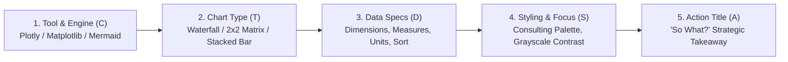

# Data Visualization Prompting Guide: How to Prompt AI for Executive Consulting Charts

[English](CHART_PROMPT_GUIDE.md) | [繁體中文](圖表生成指南.md)

In top-tier management consulting (McKinsey, Bain, BCG, IBM): **"An outstanding chart does not merely display data; it conveys a strategic conclusion (Action Title)."**

If you simply ask an AI: *"Draw a chart of our revenue over the past year,"*  
The AI typically outputs a cluttered chart with poor color harmony, suboptimal chart selection (such as an overcrowded pie chart or generic line graph), and zero business insight.

To get **100% precision** charts ready for a C-Level boardroom presentation, you must provide a comprehensive **Chart Specification Checklist (C-T-D-S-A Framework)**.

---

## 1. The 5 Core Elements of Executive Chart Prompting (C-T-D-S-A Framework)



1. **Tool & Engine Specification**:
   * **Streamlit Interactive Cockpit (Default in Tab 4 of this project)**: Specify **`Python (Plotly)`** (enables dynamic code compilation and client-side hover tooltips and zooming).
   * **Static Markdown Reports & Architecture**: Specify `Mermaid.js`, `SVG`, or `PlantUML`.
   * **Academic / Print Reports**: Specify `Python (Matplotlib / Seaborn)`.
2. **Precise Chart Type Selection**:
   * Never let the AI guess! State the exact chart type tailored to your strategic intent:
     * **Root-Cause Attribution / Profit Variance** ➔ Waterfall Chart
     * **Strategic Prioritization / Resource Allocation** ➔ 2x2 Strategy Matrix (Quadrant Plot)
     * **Structural Composition Over Time** ➔ 100% Stacked Bar Chart
     * **Conversion & Drop-off** ➔ Funnel Chart
3. **Data Source & Coordinate Mapping**:
   * Explicitly define X-axis, Y-axis, Series/Grouping (Hue), and numerical units (USD, Thousands, Percentage, Millions).
   * Specify **sorting rules** (e.g., "Sort in descending order by revenue; group 'Others' at the bottom").
4. **Consultant-Grade Visual Hierarchy & Styling**:
   * **Selective Highlighting**: Avoid rainbow palettes. Specify "Render baseline categories in neutral muted gray (`#E5E7EB`); highlight target/anomaly items in high-contrast corporate accent color (e.g., Deep Navy `#1E3A8A` or Crimson `#DC2626`)."
   * **Direct Data Labels**: Specify "Directly annotate values at the end of each bar; suppress redundant background gridlines."
5. **Conclusion-Driven Action Title ('So What?')**:
   * The headline of an executive slide must be a **takeaway conclusion**, not a passive description (e.g., write *"APAC logistics surcharges surged 34% in Q3, eroding net operating margin,"* not *"Q3 Regional Cost Breakdown"*).

---

## 2. Negative Constraints Checklist

Adding this "guardrail block" to your prompt immediately filters out 90% of low-quality AI chart outputs:

```text
[Negative Constraints]
- Do NOT use 3D effects, bevels, or drop-shadows.
- Do NOT use rainbow colormaps (jet, rainbow).
- Ensure legends never overlap data points, lines, or trend labels.
- For pie charts, limit slices to <= 5; if categories exceed 5, automatically convert to a horizontal bar chart.
- Add thousand-separator commas (,) and currency/percentage symbols ($ or %) to prevent raw float strings.
```

---

## 3. High-Frequency Executive Prompt Templates

### 1. Strategic Prioritization 2x2 Matrix (Python Plotly)
> **Use Case**: Prioritizing digital initiatives or feature backlog (Impact vs. Effort) in the Streamlit Cockpit.

```text
Please write standalone, executable Python (using Plotly) code to render a "Strategic Prioritization 2x2 Matrix (Impact vs. Effort)":
1. Axis Definitions:
   - X-axis: Implementation Effort & Cost (Range: 0 to 10; midline threshold at 5)
   - Y-axis: Commercial Impact & Return (Range: 0 to 10; midline threshold at 5)
2. Four Quadrants (draw subtle background shaded rectangles using add_shape):
   - Top-Left (High Impact / Low Effort): Light green tint (#E8F5E9) "Top Priority Quick Wins"
   - Top-Right (High Impact / High Effort): Light blue tint (#E3F2FD) "Strategic Bets"
   - Bottom-Left (Low Impact / Low Effort): Light gray tint (#F5F5F5) "Fill-ins"
   - Bottom-Right (Low Impact / High Effort): Light red tint (#FFEBEE) "Thankless Tasks"
3. Scatter Points with Text Annotations:
   - Automated Quotation Engine: Effort=2.5, Impact=8.5 (Quick Win, highlight in bold dark green #2E7D32)
   - Core ERP Migration: Effort=8.0, Impact=8.0 (Strategic Bet, blue #1565C0)
   - Weekly Reporting Automation: Effort=2.0, Impact=2.5 (Fill-in, gray #757575)
   - Custom Ad-hoc Client Report: Effort=7.5, Impact=3.0 (Thankless Task, gray #757575)
4. Visual Focus: Enlarge the marker size for "Automated Quotation Engine" and annotate with an indicator arrow.
5. Action Title & Subtitle:
   - Main Title: "Resource allocation should aggressively focus on 'Automated Quotation Engine' to unlock sales capacity within 30 days"
   - Subtitle: "2026 Q3 Digital Transformation Initiatives (Impact vs. Effort 2x2 Matrix)"
```

---

### 2. Profit Variance Waterfall Chart (Python Plotly)
> **Use Case**: Boardroom financial decomposition explaining how revenue transitions to net profit.

```text
Please write standalone, executable Python (using Plotly) code to render a "Profit Variance Waterfall Chart":
1. Data Series (in Millions USD):
   - Baseline Gross Revenue: +120
   - Raw Material Procurement: -45
   - Freight & Supply Chain Surcharges: -18
   - R&D & Personnel OPEX: -25
   - Sales & Marketing Spend: -12
   - Non-operating Income: +5
   - Net Operating Profit: Total (cumulative summary)
2. Color Scheme:
   - Positive additions: Forest Green (#2E7D32)
   - Negative deductions: Crimson Red (#C62828)
   - Summary total: Corporate Navy (#1565C0)
3. Annotations:
   - Annotate bold values above/below each bar with "+value" or "-value" prefixes.
   - Hide vertical gridlines and maintain a clean white background.
4. Action Title:
   - Main Title: "Supply chain surcharges and raw material inflation compressed Q3 net profit to $25M"
   - Subtitle: "2026 Q3 Operating Profit Bridge (Units: $M USD)"
```

---

### 3. Focus & Benchmark Horizontal Bar Chart (Python Seaborn / Plotly)
> **Use Case**: Highlighting a proprietary brand or target SKU against competitive peers.

```text
Please write clean Python (Plotly or Seaborn) code to render a "Horizontal Benchmark Bar Chart":
1. Dataset (2026 Net Profit Margin % by Product Line):
   - Product Line A: 28%
   - Product Line B (Core In-House Brand): 24%  <-- Highlight Target
   - Product Line C: 19%
   - Product Line D: 15%
   - Product Line E: 11%
   - Product Line F: 6%
2. Sorting: Descending from top to bottom by net margin.
3. Consulting Palette:
   - Highlight "Product Line B" in Royal Blue (#1E40AF).
   - Render all competitor benchmarks in neutral muted gray (#CBD5E1).
4. Direct Labels:
   - Despine the axes (remove top, right, and left borders).
   - Print exact percentage strings (e.g., "24%") directly at the right of each bar.
5. Action Title:
   - "Product Line B's 24% net margin outperforms peer category averages, justifying expanded ad spend for market share capture"
```

---

## 4. Universal Copy-Paste Chart Prompt Template

Copy the template below and replace the bracketed `[ ]` placeholders:

```text
[Role & Tool Specification]
Act as an Executive Information Designer at a top management consulting firm (MBB).
Use [Specified Engine: Python Plotly / Python Matplotlib / Mermaid.js] to create a publication-grade chart.

[Chart Type & Strategic Objective]
- Chart Type: [e.g., Horizontal Benchmark Bar / 2x2 Strategy Matrix / Trend Line / Waterfall]
- Primary Audience: [e.g., Board of Directors / Operating Committee / Venture Investors]
- Action Title: [e.g., Marketing Channel C achieves a 4.2x ROI, justifying a 30% budget reallocation]

[Data Specification]
- X-Axis / Categories: [Provide category list, e.g., Product Lines A, B, C, D]
- Y-Axis / Metric & Unit: [Provide numbers and unit, e.g., Revenue in $M or Conversion Rate in %]
- Sorting Order: [e.g., Descending by metric / Chronological]

[Visual & Styling Guidelines]
1. Color Palette: Apply an executive muted gray + accent highlight strategy. Render [Target Item] in [Accent Color like Navy or Red], and all other items in neutral gray (#D1D5DB).
2. Data Labels: Directly label numerical values beside or above elements in bold with unit symbols ($ or %).
3. Minimalism: Remove redundant background grids and border lines for zero-friction readability.

[Deliverable]
Provide standalone executable code with a 2-sentence executive takeaway interpreting the visual.
```

> 💡 **Streamlit Pro-Tip**: When testing inside the **Streamlit Executive Cockpit (Tab 4: AI Natural Language Chart Generator)**, always specify **`Python Plotly`** so the application can dynamically execute and render the interactive chart!
