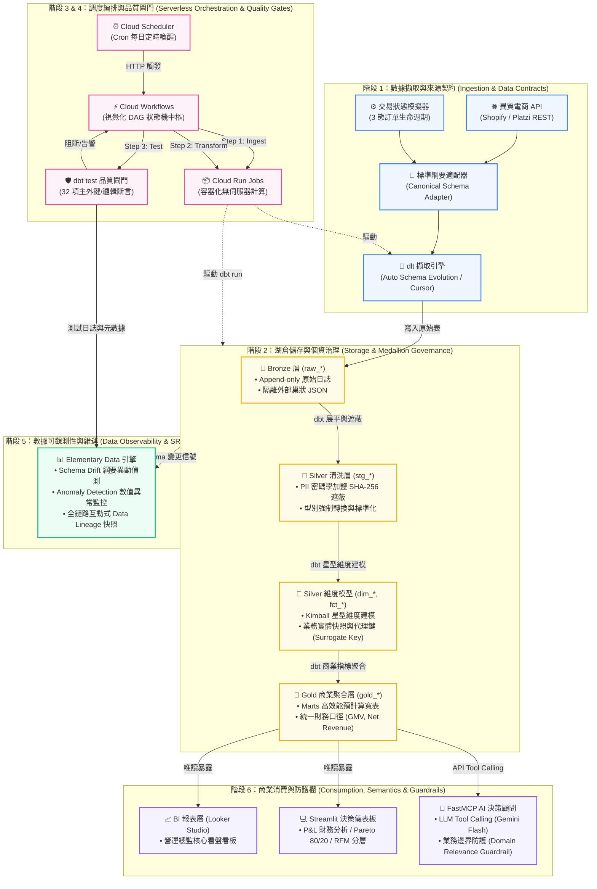

# DataOps 資料管線系統架構規範與工程決策守則 (Data Pipeline Engineering Playbook)

> **文件定位**：本文件作為資料團隊（Data Engineers, Analytics Engineers, Platform Engineers）之統一架構規範（Engineering Standard）。旨在透過 DataOps 思維，建立具備**高彈性、可維護性、零閒置成本（FinOps）與嚴格資料品質（Quality Gates）**的生產級現代數據中台。

---

## 🏛️ 全鏈路端到端系統架構圖 (End-to-End System Architecture)

---

## 🔍 分階段系統設計深度剖析、決策原因與工程檢核表 (Stage-by-Stage Playbook)

---

### 階段 1：數據擷取與來源契約 (Ingestion & Data Contracts)

#### 1. 為什麼這樣設計？（架構決策原因）
* **捨棄自寫 SQL 匯入，採用 `dlt` 引擎**：
  * *原因*：外部電商 API（Shopify、客製 POS）常常隨意增減 JSON 欄位。自刻 Python 腳本會因為欄位缺失或型別變更頻繁掛掉；`dlt` 具備自動推導資料型態與**綱要自動演進（Schema Evolution）**能力。
* **堅持引入適配器模式（Canonical Schema Adapter）**：
  * *原因*：若將原始 API 欄位直接灌給下游 dbt，每換一家電商源頭（如從 Platzi 換到 91APP 或 Shopify），整套 dbt 模型就必須重寫。透過 `PlatziStoreAdapter` 將資料統一標準化為 `raw_orders`, `raw_order_items`, `raw_customers`, `raw_products`，下游轉換邏輯便具備 **100% 可移植性**。
* **增量游標設計（Watermark / Cursor）**：
  * *原因*：避免每次排程全表拉取（Full Fetch）。依賴 `updated_at` 欄位僅抓取最新異動數據，將網路傳輸與 BigQuery 寫入量降到最低。

#### 2. 未來工程決策需注意事項
* **破壞性變更防護（Breaking Changes）**：雖然 `dlt` 能自動加欄位，但如果上游「修改現有欄位型態」（例如 `string` 突然變 `array`）仍會引發異常。需在 Adapter 處加上欄位保護或反序列化 Try-Catch。
* **API Rate Limit 與指數退避**：外部 API 經常有 `429 Too Many Requests`。必須確保 Request 庫內建 Exponential Backoff 重試邏輯。
* **時鐘偏差（Clock Drift）**：伺服器與資料庫時間可能有 1~2 秒偏差，增量拉取時游標建議往前寬限緩衝 5~10 分鐘（Overlap Window），並由下游維度模型透過主鍵去重。

#### 3. 工程檢核清單 (Ingestion Checklist)
- [ ] 來源連線是否抽離為 Adapter 類別，不與下游 SQL 邏輯耦合？
- [ ] 增量拉取（Incremental Load）是否設定了可靠的時間戳記游標（`updated_at`）？
- [ ] 是否實作了針對 HTTP 429 / 503 的指數退避重試（Exponential Backoff）機制？
- [ ] 寫入 Bronze 層是否採用 Append-only，完整保留原始資料的不可變日誌（Immutable Log）？
- [ ] 資料來源認證憑證（API Token / Service Account）是否統一由 Secret Manager 管理，絕無寫死（Hardcoded）於程式碼中？

---

### 階段 2：湖倉儲存與個資治理 (Storage & Medallion Governance)

#### 1. 為什麼這樣設計？（架構決策原因）
* **採用 Medallion 獎章分層架構（Bronze ➔ Silver ➔ Gold）**：
  * *原因*：職責單一化。Bronze 保留髒數據與追溯歷史；Silver 負責清洗展平與建立 Kimball 星型維度模型；Gold 負責高階商業聚合。這能杜絕「一張 SQL 寫 500 行把清洗與報表混在一起」的泥球架構。
* **在 Silver Staging 層進行 PII 加鹽雜湊（Salted Hashing）**：
  * *原因*：合規與隱私安全（GDPR / 台灣個資法）。顧客真實姓名與電子郵件在 Staging 階段即經過密碼學 SHA-256 加鹽雜湊，分析師、BI 工具與 AI 顧問永久接觸不到原始個人資料，徹底杜絕外洩風險。
* **維度建模（Kimball Star Schema：Dim / Fact）**：
  * *原因*：分析型查詢講求效能與維護性。將訂單實體分離為「事實表（`fct_orders`, `fct_order_items`）」與「維度表（`dim_customers`, `dim_products`）」，使下游計算指標（如客單價、品類銷售）無需重複進行高成本的多表全關聯。

#### 2. 未來工程決策需注意事項
* **分區（Partitioning）與叢集（Clustering）策略**：
  * 當事實表數據量突破數百萬筆時，必須在 BigQuery 設定依據 `order_date` 分區（Partition by Day），並依 `customer_id` 或 `status` 叢集（Cluster），這能大幅降低查詢掃描費用（可節省 70%~90% 成本）。
* **代理鍵（Surrogate Key）機制**：
  * 外部來源的業務主鍵（Natural Key）可能重複（例如跨系統遷移後 ID 撞號）。維度表應使用 `dbt_utils.generate_surrogate_key` 生成 MD5/SHA256 代理主鍵。
* **慢變維度（SCD Type 2）評估**：
  * 若商品價格或類別經常變動，且業務要求看歷史時點的價格，需考慮導入 dbt Snapshot 來記錄歷史拉鍊表。

#### 3. 工程檢核清單 (Storage & Governance Checklist)
- [ ] Bronze / Silver / Gold 三層結構是否具有明確的權限與存取隔離？
- [ ] 所有涉及 PII（姓名、電話、Email）欄位是否皆在進入 Silver 前完成脫敏遮蔽或加鹽雜湊？
- [ ] 事實表與維度表是否定義了明確的主鍵（Primary Key）與外鍵關聯契約？
- [ ] 大表（Fact Tables）是否已規劃好分區（Partition by Date）與叢集（Cluster）規則？
- [ ] 是否設定了原始日誌資料的生命週期原則（Lifecycle Policy / Cold Storage），定期將老舊數據歸檔？

---

### 階段 3：數據轉換與品質保證閘門 (Transformation & Quality Gates)

#### 1. 為什麼這樣設計？（架構決策原因）
* **全宣告式 dbt 轉換取代傳統 Procedural ETL（如 Stored Procedure）**：
  * *原因*：dbt 提供純 SQL 宣告式定義，由框架自動解析 `ref()` 依賴並編譯為 DAG 圖。轉換邏輯可接受 Git 版本控管、CI/CD 審查與自動產生文檔。
* **建構 32 項自動化測試作為品質閘門（Quality Gates）**：
  * *原因*：實現 **Write-Audit-Publish（寫入-審計-發布）**。上游資料只要出現非預期的空值、重複主鍵或負數金額，測試階段會立即拋出 Exit Code 阻斷管線，杜絕髒資料流向對外發布的儀表板。
* **指標口徑集中化治理**：
  * *原因*：全公司只能有一種「淨營收（Net Revenue）」與「GMV」計算方式，扣除取消與退款的邏輯全部封裝在 `fct_orders.sql`，前端分析師不需在各自的 BI 工具內手寫 `CASE WHEN`。

#### 2. 未來工程決策需注意事項
* **增量模型（Incremental Models）轉換時機**：
  * 目前展示規模可每次 `table` 全量重刷（Full Refresh）；但當事實表日增長達 10 萬筆以上時，必須將 `fct_*` 改為 `materialized='incremental'`，並搭配 `is_incremental()` 巨集只處理增量數據。
* **測試執行時間控制**：
  * 隨著資料膨脹，若每次都對數千萬筆資料做 `unique` 測試會導致計算成本暴增。未來應改為「每日增量測試」或引入 Elementary 的取樣/異常統計測試。

#### 3. 工程檢核清單 (Transformation & Test Checklist)
- [ ] 所有模型間的參照是否嚴格使用 `ref('model_name')`，無任何直接 Hardcode 的資料表名稱？
- [ ] 核心模型的主鍵是否皆配置了 `unique` 與 `not_null` 測試？
- [ ] 所有外鍵是否配置了 `relationships` 參照完整性測試？
- [ ] 關鍵商業欄位（金額、狀態）是否設定了邏輯斷言（`accepted_values`、`>= 0`）？
- [ ] 開發環境（Dev）與生產環境（Prod）是否具備不同的 Target Schema，互不干擾？

---

### 階段 4：排程與工作流編排 (Serverless Orchestration & Visual DAG)

#### 1. 為什麼這樣設計？（架構決策原因）
* **全面捨棄 Apache Airflow / Cloud Composer，改採全無伺服器架構**：
  * *原因（極致 FinOps）*：傳統 Airflow（如 Google Cloud Composer）需要常駐 GKE 集群，每月基本維運費高達 $300~$500 美元。對於每日僅批次執行 1~2 次的中小企業而言，這是極大的浪費。
  * 改採 **Google Cloud Scheduler + Google Cloud Workflows + Cloud Run Jobs**：
    * 閒置時完全零虛擬機、零容器、**每月閒置成本為 $0**。
    * 每次管線執行僅需數分鐘，每月雲端總帳單通常在數美元以內甚至在免費額度內。
* **引入 Cloud Workflows 實現原生 Visual DAG**：
  * *原因*：改善「單一容器黑盒子」問題。透過 Workflows 定義狀態機，可以在 GCP Console 視覺化檢視 Ingest ➔ Transform ➔ Test 各階段執行耗時，任一步驟失敗能立即定位。

#### 2. 未來工程決策需注意事項
* **Cloud Run Job 的執行逾時上限**：
  * Cloud Run Job 目前單次執行上限預設為 60 分鐘。若未來單一批次資料轉換預計超過 1 小時，需拆分為更細粒度的 Job，或改以 Dataproc Serverless 處理。
* **並行度與資源配額（Concurrency & RAM）**：
  * 容器資源（如記憶體 2Gi、CPU 1Core）需配合管線吞吐量在 Terraform 宣告時預留成長空間。
* **跨管線依賴（Sensor 機制）**：
  * 若未來需要等候外部上游資料就緒（S3/GCS 檔案抵達），需在 Workflows 中配置輪詢（Polling Step）或改採事件驅動（Eventarc + Pub/Sub 觸發）。

#### 3. 工程檢核清單 (Orchestration Checklist)
- [ ] 工作流調度是否已解耦為獨立階段（Ingest / Transform / Test），具備清楚的 Visual DAG？
- [ ] 排程是否具備容錯與重試機制（Retry with Backoff）？
- [ ] 所有基礎設施（Scheduler, Workflows, Cloud Run Jobs, IAM）是否皆透過 Terraform 程式碼化管理（IaC）？
- [ ] Job 是否具備逾時限制（Timeout Limits），防止無窮迴圈耗盡運算預算？
- [ ] 執行結果（成功/失敗）是否能即時反饋並具備日誌可追蹤性（Cloud Logging）？

---

### 階段 5：數據可觀測性與維運 (Data Observability & SRE)

#### 1. 為什麼這樣設計？（架構決策原因）
* **引入 Elementary Data 取代人工定期查驗**：
  * *原因*：數據工程最常被詬病的是「業務部門比工程師先發現數字怪怪的」。Elementary 能夠在每次 `dbt test` 執行後，自動採集元數據並生成靜態或託管的互動式觀測報告（`elementary_report.html`）。
* **全鏈路互動式 Data Lineage（數據血緣）**：
  * *原因*：當一張 Gold 層報表出現異動時，工程師能一鍵展開血緣樹，清楚了解是哪張 raw 表或中間哪段 SQL 模型影響了結果，大幅縮短平均修復時間（MTTR, Mean Time to Resolution）。
* **綱要漂移（Schema Drift）自動追蹤**：
  * *原因*：上游無預警刪除欄位或變更型態時，可觀測性層能在管線產生連鎖骨牌效應前即時告警。
* **🚀 雲端自動發布與託管機制（GCS Static Hosting）**：
  * *原因*：免除人工手動執行 `edr report`。在 Cloud Run Jobs 的 Test 階段結束時，`pipeline_runner.py` 自動觸發報告產出並直傳至專屬 Google Cloud Storage (GCS) Bucket，生成固定靜態網址（`https://storage.googleapis.com/de-consulting-508822_cloudbuild/elementary_report.html`），全團隊隨時開啟皆為當天最新執行狀態！

#### 2. 未來工程決策需注意事項
* **告警降噪與告警疲勞（Alert Fatigue）**：
  * 告警必須分級：`P1 - Critical`（主鍵重複、金額錯誤）需立即打電話或發送 PagerDuty；`P3 - Warning`（輕微資料量波動）僅記錄在 Slack/Teams 頻道每週複查。
* **SLA / SLO 明確化**：
  * 必須與業務單位簽訂資料服務協議（如「每日早上 08:00 前 Gold 層數據保證就緒，新鮮度小於 6 小時」）。

#### 3. 工程檢核清單 (Observability Checklist)
- [ ] 是否具備全鏈路數據血緣追蹤工具（如 Elementary Data），能快速進行衝擊分析？
- [ ] 是否針對關鍵資料表配置了「及時性（Freshness）」與「資料量（Volume）」監控？
- [ ] 測試報告是否配置了自動發布至 GCS Bucket，保持狀態永久最新？
- [ ] 告警渠道（Slack, Email, Webhook）是否已整合，且訊息包含失敗模型名稱與錯誤日誌連結？
- [ ] 是否定期審視過期或經常 False Alarm 的無效測試規則？

---

### 階段 6：商業消費、語意層與防護欄 (Consumption, Semantics & Guardrails)

#### 1. 為什麼這樣設計？（架構決策原因）
* **嚴格的「Gold 層唯讀暴露原則」**：
  * *原因*：嚴禁讓 BI 工具（Looker Studio）、戰略儀表板（Streamlit）或 AI Agent 直接讀取 Bronze 原始層或未經脫敏的 Staging 表。這不僅是資安防線，更防止下游發出未經優化的龐大查詢拖垮資料庫效能。
* **AI 顧問的商業範疇防護欄（Domain Relevance Guardrails）**：
  * *原因*：當透過 FastMCP 將資料管線開放給 LLM（Gemini）呼叫時，模型可能遭受提示注入（Prompt Injection）或被詢問無關的八卦/程式碼生成，浪費 Token。專案內建防護欄，確保 AI 僅在「電商營運、財務診斷、Pareto 分析」範圍內回覆。
* **指標預聚合與寬表化（Pre-aggregation）**：
  * *原因*：將頻繁被計算的 KPI（如每日銷售、客戶累積 LTV）直接在 Gold 層物化，讓前端儀表板實現「毫秒級響應」，大幅提升使用者體驗。

#### 2. 未來工程決策需注意事項
* **查詢配額與防爆控制（Cost Capping）**：
  * 在 BigQuery 專案上設定「單次查詢字節數上限（Maximum Bytes Billed）」或使用者的每月查詢配額，防止新手分析師誤寫笛卡兒積（Cartesian Join）導致帳單暴增。
* **BI 記憶體快取加速（BI Engine）**：
  * 若 Looker Studio 儀表板並行存取人數激增，可開啟 BigQuery BI Engine（提供 1GB 免費記憶體加速），降低重複查詢的資料庫負載。

#### 3. 工程檢核清單 (Consumption Checklist)
- [ ] 下游分析工具與 AI 介面是否嚴格限制僅能查詢 Gold 層，杜絕存取底層 Raw 表？
- [ ] 所有商業指標（如 AOV、LTV、毛利、淨額）是否有且僅有一個明確的計算公式與權威資料表？
- [ ] AI 查詢介面是否建置防護欄（Guardrails），過濾非商業領域的無效請求？
- [ ] 儀表板資料庫連線帳號是否採用最小權限原則（Least Privilege, 僅賦予 BigQuery Data Viewer 角色）？

---

## 🏆 工程同儕審查（Peer Review）快速驗收對照表

當任何新功能、新模型或新管線準備發布（PR Merge）至生產環境時，請依據此表逐項查驗：

| 驗收維度 | 審查標準 | 合格標準（Pass Criteria） |
| :--- | :--- | :--- |
| **契約隔離** | 是否有新接入的外部 API？ | 必須包裝於 Adapter 中，統一輸出 Canonical Schema。 |
| **安全隱私** | 是否引入了新的顧客資料欄位？ | 若包含真實姓名/電話/信箱，必須於 Staging 層加鹽雜湊。 |
| **品質斷言** | 新增的 dbt 模型是否具備測試？ | 主鍵必須具備 `unique` 與 `not_null`，重要關聯必須有 `relationships`。 |
| **調度成本** | 新增的運算是否需要常駐服務？ | 必須能在 Cloud Run Jobs 中無伺服器執行完畢，不增加固定月租費。 |
| **血緣可視** | 執行 `dbt run` 後血緣是否完整？ | 在 Elementary Lineage 畫布中必須有清楚的上下游串聯，無孤兒節點。 |
| **口徑一致** | 是否新增了對外的商業指標？ | 指標邏輯需收斂於 Gold 模型，並在 Schema.yml 補齊描述與業務定義。 |
