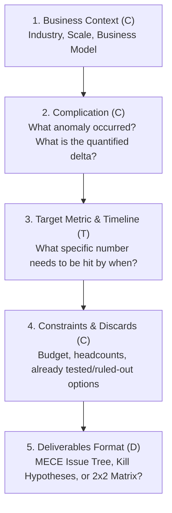

# Management Consultant Prompting Guide: How to Prompt AI Like an MBB Partner

[English](PROMPT_GUIDE.md) | [繁體中文](提問框架.md)

> In top-tier management consulting firms (McKinsey, Bain, BCG, IBM), there is a famous adage: **"Garbage In, Garbage Out."**

If you ask: *"Our company revenue is declining, what should we do?"*  
Even with an elite consulting skill like `claude-skill-management-consultant-B1`, the AI can only respond with generic textbook advice (e.g., acquire new customers, raise average order value, increase marketing).

To truly unleash the power of the 129 specialized consulting modules, you must **"Prompt the Consultant in the Language of a Consultant."**

---

## 1. The 5 Core Building Blocks of Executive Prompting (C-C-T-C-D Framework)

To prevent generic outputs, ensure your prompt includes these 5 critical elements:



1. **Business Context & Model (Context)**:
   * Who are you? What do you sell, and to whom? (B2B vs. B2C? Direct sales, subscription, marketplace take-rate?)
   * Market position and current scale (Annual ARR/GMV, category leader or challenger?)
2. **Complication & Trigger Event (Complication)**:
   * What anomaly or disruption occurred? (**Must be quantified**, e.g., "Customer Acquisition Cost (CAC) surged 40% last quarter," not "marketing has been ineffective lately").
3. **Target Metric & Timeline (Target)**:
   * A quantified milestone, e.g., "Reduce monthly churn rate from 8% to 4% within 6 months," not "improve customer retention."
4. **Constraints & Discarded Paths (Constraints)**:
   * Boundaries: Budget capped at $200k, zero headcount expansion, regulatory limitations.
   * **What initiatives have already been tested or ruled out?** (Prevents AI from regurgitating solutions you already know).
5. **Requested Consulting Deliverables (Deliverables)**:
   * Explicitly specify the output format: MECE Issue Tree, Testable Kill Hypotheses, 2x2 Prioritization Matrix, or C-Suite Executive Deck Outline.

---

## 2. Generic Prompting vs. Consultant-Grade Prompting

| Scenario | ❌ Generic Prompt (Gets Textbook Fluff) | ✅ Consultant-Grade Prompt (Triggers Deep Modules) |
| :--- | :--- | :--- |
| **Margin Compression** | "Our e-commerce profits have gotten thinner recently, any good strategies to improve?" | "We are a B2C apparel brand with $5M ARR (AOV ~$40). Over the past 2 quarters, **Gross Margin remained at 55%, but Net Margin collapsed from 18% to 6%**. Early attribution suggests Meta Ad CAC increased by 60%, and 90-day repeat purchase rate fell 25%.<br><br>**Target**: Recover Net Margin to >= 12% within 2 quarters without expanding the total marketing budget.<br>**Request**: Deconstruct this problem using a DuPont profit formula and MECE issue tree, and isolate the top 3 kill hypotheses to validate first." |
| **New Market Entry** | "We want to expand our product into the Japanese market, what is the best approach?" | "We are an enterprise HR SaaS based in Taiwan ($1M ARR, 92% NRR), evaluating market entry into Japan in 2027.<br><br>**Constraints**: Initial international expansion budget is $300k, with no existing on-the-ground local team.<br>**Request**: Using Porter's Five Forces and Go-to-Market (GTM) frameworks, design an evaluation matrix (Direct Sales vs. Value-Added Resellers vs. Joint Venture), and list the top 5 commercial due-diligence questions we must answer before committing capital." |
| **Digital / AI Transformation** | "We are a logistics company looking to adopt AI, how should we plan it?" | "We are a regional cold-chain 3PL logistics provider operating a fleet of 120 trucks. Key friction points: manual routing dispatch leads to an 8% shipment delay rate, and parcel status inquiry absorbs 30% of customer service capacity.<br><br>**Target**: Prioritize GenAI and predictive dispatch algorithm implementation over an 18-month horizon.<br>**Request**: Apply IBM Enterprise Design Thinking and an Impact vs. Effort matrix to deliver an actionable 30-60-90 day digital roadmap, explicitly detailing potential organizational resistance and operational risks." |

---

## 3. Copy-Paste Universal Prompt Template

You can copy the template below, replace the bracketed `[ ]` sections with your specific case, and send it to the AI:

```text
[Role Setting]
Activate the management-consultant module and adopt the persona of an MBB / IBM Engagement Manager.

[Business Context]
- Industry & Market: [e.g., Wealth Management for HNWIs / B2B Precision Electronic Components]
- Business Model & Scale: [e.g., $10M Annual Revenue, High Ticket Size, Custom Project Deliveries]
- Core Competitive Moat: [e.g., Proprietary R&D engineering, but lengthy enterprise sales cycle]

[Complication & Current Reality]
- Specific Phenomena & Data: [e.g., Sales funnel drops 65% of qualified leads between Quote and Contract signing]
- Tested / Discarded Solutions: [e.g., Offered 15% discount promotions with negligible conversion lift; do not want a price war]

[Target & Constraints]
- Primary Target: [e.g., Increase contract closing conversion rate from 35% to 50% within 6 months]
- Boundaries & Constraints: [e.g., Zero sales headcount additions; maintain product gross margin >= 40%]

[Expected Deliverables]
1. Do NOT jump straight to final recommendations. First, provide a MECE Issue Tree decomposing potential root causes.
2. Formulate the top 3 "Kill Hypotheses" that must be prioritized for empirical data validation.
3. At the end of your response, ask me the 3 most incisive clarification questions that would best narrow the strategic scope.
```

---

## 💡 Pro Tip: The "Turn the Tables" Technique

Top-tier consultants **never prescribe solutions immediately in client kickoffs — they interrogate assumptions first**.

If your business problem is still evolving, append this single sentence to your prompt:

> **"Before delivering the final recommendations, act as a Senior Strategy Partner and ask me 3 to 5 critical, probing commercial or data questions that I have not yet addressed."**

This immediately switches the AI into an active client interview & diagnosis mode, uncovering operational blind spots and transforming an ordinary conversation into a million-dollar strategic advisory session!
