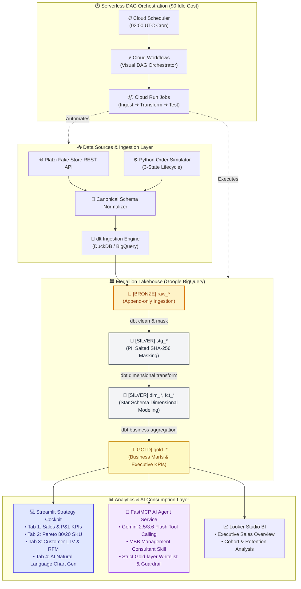

# Modern Serverless E-Commerce ELT Data Pipeline, Lakehouse & AI Strategy Cockpit

[English](README.md) | [繁體中文](README_zh.md)

[](https://github.com/shin7965977/data-pipeline-consulting-demo/actions/workflows/ci.yml)
[](https://www.python.org/)
[](https://www.getdbt.com/)
[](https://dlthub.com/)
[](https://streamlit.io/)
[](https://ai.google.dev/)
[](https://github.com/jlowin/fastmcp)
[](LICENSE)

An end-to-end, enterprise-grade Modern Data Stack (MDS) implementation designed for **e-commerce retail intelligence and C-Level management consulting demos**. Built with a **Serverless-first, near-$0/month idle TCO** architecture, strict **Medallion Data Lakehouse** engineering, **Data Observability**, **Interactive Streamlit Executive Cockpit**, **Looker Studio BI**, and an **MBB-Level AI Operations Copilot** powered by FastMCP and Google Gemini.

---

## 🏛️ Architecture Overview



### 💼 Key Consulting Highlights
1. **Near-$0/mo Idle TCO (Serverless Visual DAG)**: Instead of paying 24/7 for managed Airflow (Cloud Composer ~ $300+/mo), orchestration is driven by a hybrid serverless DAG: **Google Cloud Scheduler + Google Cloud Workflows + Cloud Run Jobs** (~ $0/mo idle cost; monthly 5,000 steps free tier, documented in [ADR-0003](docs/adr/0003-serverless-dag-orchestration-with-cloud-workflows.md)).
2. **Visual Step-by-Step DAG Pipeline**: Cloud Workflows (`platzi-pipeline-orchestrator`) coordinates 3 sequential stages with automated long-polling and retry policies:
   - **Step 1**: Ingest (`dlt` from API to BigQuery Bronze)
   - **Step 2**: Transform (`dbt run` for Silver dimensional models & Gold marts)
   - **Step 3**: Data Observability & Tests (`dbt test` + Elementary anomaly checks)
3. **Canonical Schema Adapter Pattern**: Upstream e-commerce APIs (Shopify, WooCommerce, Platzi) are mapped into standardized schema contracts, insulating dbt models from source schema drift.
4. **Enterprise PII Governance**: Names and emails are cryptographically salted and SHA-256 hashed at the staging layer; AI agents and BI dashboards never touch raw customer identities.
5. **Data Observability**: Pre-integrated with **Elementary Data** for automated test anomaly detection, schema drift monitoring, and run history auditing.
6. **Interactive Streamlit Executive Cockpit (`dashboard.py`)**: Real-time KPI monitoring, Plotly data visualizations, RFM customer segmentation, and an AI-driven natural language chart generator.
7. **MBB Management Consultant AI Skill (`claude-skill-management-consultant-B1`)**: 129 consulting modules enforcing the **Pyramid Principle (Action Titles)**, **MECE Issue Trees**, **Net Realization Rate** calculations, and **30-60-90 Day Tactical Roadmaps**.
8. **Domain Relevance AI Guardrails**: Intelligent prompt filtering that strictly defends the assistant against off-topic queries (e.g., politics, entertainment) to ensure professional focus.

---

## 🛠️ Technology Stack

| Layer | Technology | Purpose |
| :--- | :--- | :--- |
| **Infrastructure as Code** | Terraform | BigQuery datasets, Cloud Run Jobs, Cloud Workflows, Cloud Scheduler & IAM |
| **Data Ingestion** | `dlt` (data load tool) | Resilient schema evolution, automatic batching, typing & incremental loading |
| **Data Transformation** | `dbt-core` + DuckDB / BigQuery | Medallion staging, Star Schema dimensional modeling & Gold marts |
| **Data Observability** | `elementary-data` + dbt tests | Automated schema test assertions, uniqueness & referential integrity |
| **Orchestration & DAG** | Cloud Scheduler + Cloud Workflows + Cloud Run | Serverless visual DAG (`Ingest -> Transform -> Test`) with $0 idle cost |
| **Executive Cockpit** | Streamlit + Plotly | Interactive analytics dashboard with P&L, Pareto SKU, and RFM tiers |
| **AI Chart Generation** | Google GenAI SDK (Gemini Flash) | Text-to-Chart engine with instant Plotly rendering & domain guardrail |
| **AI Strategy Consulting** | FastMCP + MBB Consultant Skill | Tool calling over BigQuery Gold marts with structured strategic advisory |
| **Containerization** | Docker (Multi-stage) | Lean, reproducible image pre-baked with dbt packages and dependencies |
| **BI & Analytics** | Google Looker Studio | Executive dashboards, KPI monitoring & customer cohort retention |
| **CI / CD Quality Gates** | GitHub Actions + Ruff + SQLFluff | Automated static analysis, SQL linting, and full test suite enforcement |

---

## 🚀 Quick Start (Local Demo)

You can run the entire pipeline locally in under 60 seconds without requiring a Google Cloud account (using local DuckDB).

### 1. Prerequisites
- Python 3.11+
- Git

### 2. Clone & Setup
```bash
git clone https://github.com/shin7965977/data-pipeline-consulting-demo.git
cd data-pipeline-consulting-demo

# Create virtual environment
python -m venv .venv
# Windows:
.\.venv\Scripts\activate
# Linux/macOS:
source .venv/bin/activate

# Install dependencies
pip install -r requirements.txt
```

### 3. Run Pipeline Locally
```bash
# Execute end-to-end (Simulator -> Ingestion -> Staging -> Silver -> Gold Marts)
python pipeline_runner.py --target=all --dataset=test_pipeline.duckdb
```

### 4. Launch Interactive Streamlit Executive Dashboard
```bash
streamlit run dashboard.py
```
* **Tab 1: 📊 Revenue & Operational KPIs** — Daily GMV, Net Revenue realization trends, and cancellation/refund rate tracking.
* **Tab 2: 🏆 Product Performance & Contribution** — Top SKU leaderboard, category contribution, and Pareto 80/20 concentration analysis.
* **Tab 3: 💎 Customer Lifetime Value (LTV) & Segmentation** — RFM tiers (Platinum VIP / Gold / Silver / Bronze) and AOV distribution.
* **Tab 4: 📈 AI Natural Language Chart Generator** — Real-time interactive Plotly chart generation powered by Gemini with domain guardrails.
* **Sidebar: 🤖 FastMCP AI Strategy Copilot** — Embedded partner-level advisory with BigQuery tool calling and MBB structured diagnostics.

### 5. Run Docker Container
```bash
docker compose run pipeline --target=all
```

---

## 🤖 FastMCP AI Agent & Strategy Consulting

The FastMCP server allows LLM assistants (such as Claude Desktop, OpenAI agents, or Gemini Copilot) to query e-commerce analytics safely through natural language.

### Security Invariants
- 🔒 **Gold Layer Whitelisting**: The MCP server strictly forbids access to `platzi_bronze` and `platzi_silver` to prevent PII leaks.
- 🛡️ **PII Redaction**: Customer identifiers (names, emails) are permanently cryptographic-hashed.
- ⚡ **Byte Scan & Limit Caps**: Queries enforce `MAX_BYTES_BILLED` (100MB cap) and row limits to eliminate unexpected cloud spend.

### Start the MCP Server
```bash
python mcp_server/server.py
```

### Available AI Tools
- `get_daily_sales_kpi(start_date, end_date, limit)`: GMV, Net Revenue, completed orders, cancellations, and refund rates.
- `get_top_products(metric, limit)`: Top performing products ranked by total revenue or units sold.
- `get_customer_metrics(limit)`: High-value customer LTV percentiles, frequency, and monetary scores.

---

## 📖 Management Consulting & Data Visualization Prompting Guides

This repository codifies the problem-solving methodologies of McKinsey, Bain, BCG (MBB), and IBM into actionable prompting blueprints:

- 👉 **[Management Consultant Prompting Guide (PROMPT_GUIDE.md)](PROMPT_GUIDE.md)** / [繁體中文版](提問框架.md):
  - **C-C-T-C-D 5-Piece Framework**: Context, Complication, Target metric, Constraints, and Deliverables format.
  - **Fluffy vs. Consultant-Grade Comparison Table** (Margin compression, new market expansion, digital transformation).
  - **Copy-Paste Universal Prompt Template** and the "Turn the Tables" client interrogation technique.
- 👉 **[Data Visualization Prompting Guide (CHART_PROMPT_GUIDE.md)](CHART_PROMPT_GUIDE.md)** / [繁體中文版](圖表生成指南.md):
  - **C-T-D-S-A Chart Specification Framework**: Tool & engine, Type, Data mapping, Styling hierarchy, and Action Title.
  - **Negative Constraints Checklist**: Banishing 3D effects, rainbow palettes, and overcrowded pie charts.
  - **3 High-Frequency Executive Templates**: Strategic Prioritization 2x2 Matrix (Plotly), Profit Variance Waterfall (Plotly), and Horizontal Benchmark Bar (Seaborn/Plotly).

---

## 📊 Business Intelligence (Looker Studio)

Connect Looker Studio natively to BigQuery Gold Marts:
- **`gold_daily_sales_kpi`**: Trend lines for Daily GMV vs. Net Revenue, cancellation rates.
- **`gold_product_performance`**: Category contribution matrix and unit volume leaderboards.
- **`gold_customer_ltv`**: Customer segmentation tiers, average order value distributions.

Detailed dashboard setup blueprints and formulas are provided in [docs/looker_studio_guide.md](docs/looker_studio_guide.md).

---

## 🛡️ Automated Quality Gates (CI/CD)

Every pull request automatically passes through strict quality gates:
1. **Python Quality**: `ruff check` (linting & import sorting).
2. **SQL Standards**: `sqlfluff lint` against BigQuery/dbt conventions.
3. **Unit & Contract Tests**: `pytest tests/` verifying:
   - Order simulator lifecycle transitions (`completed` -> `cancelled`/`refunded`).
   - Canonical Schema contracts.
   - FastMCP security boundary enforcement.
   - End-to-end dbt run and test assertions.

---

## 📄 License
This project is open-source under the [MIT License](LICENSE).
