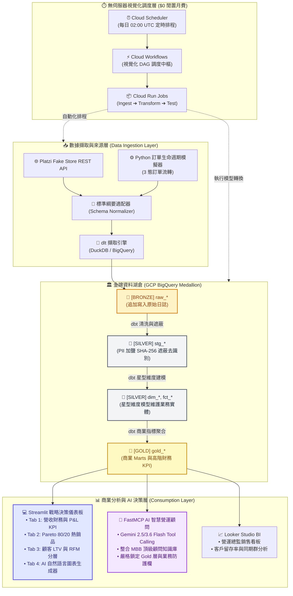

# 現代化無伺服器電商 ELT 數據管線、資料湖倉與 AI 戰略決策儀表板

[English](README.md) | [繁體中文](README_zh.md)

[](https://github.com/shin7965977/data-pipeline-consulting-demo/actions/workflows/ci.yml)
[](https://www.python.org/)
[](https://www.getdbt.com/)
[](https://dlthub.com/)
[](https://streamlit.io/)
[](https://ai.google.dev/)
[](https://github.com/jlowin/fastmcp)
[](LICENSE)

這是一套端到端、企業級的現代數據堆疊（Modern Data Stack, MDS）解決方案，專為**零售電商商業智慧與 C-Level 管理顧問諮詢展示**而設計。架構具備 **無伺服器優先、每月閒置成本趨近於 $0** 的極致 TCO 優勢，嚴格落實 **金牌資料湖倉（Medallion Architecture）**、**數據可觀測性（Data Observability）**、**互動式 Streamlit 戰略儀表板**、**Looker Studio BI**，以及由 FastMCP 與 Google Gemini 驅動的 **MBB 頂級顧問級 AI 智慧營運助手**。

---

## 🏛️ 全面架構全景（Architecture Overview）



### 💼 顧問級核心特色（Key Highlights）
1. **極致 TCO（每月近 $0 閒置成本）**：不需 24 小時常駐昂貴的 Airflow 伺服器（Cloud Composer 每月約 $300+ 美元），全面改採無伺服器架構：**Google Cloud Scheduler + Google Cloud Workflows + Cloud Run Jobs**（Workflows 每月提供 5,000 steps 免費額度，閒置期間費用為 $0，詳見 [ADR-0003](docs/adr/0003-serverless-dag-orchestration-with-cloud-workflows.md)）。
2. **視覺化循序 DAG 管線**：由 Cloud Workflows (`platzi-pipeline-orchestrator`) 串接三個標準作業階段，具備自動長輪詢與重試容錯：
   - **階段 1**：Ingest（透過 `dlt` 批次載入 API 數據至 BigQuery Bronze 層）
   - **階段 2**：Transform（透過 `dbt run` 建立 Silver 星型維度與 Gold 商業 Marts）
   - **階段 3**：Data Observability & Tests（透過 `dbt test` 與 Elementary 進行異常偵測）
3. **標準綱要適配器模式（Canonical Schema Adapter）**：將上游異質電商 API（Shopify、WooCommerce、Platzi）映射至統一的契約綱要，隔離源頭變更對下游 dbt 模型的衝擊。
4. **企業級個資隱私治理（PII Governance）**：顧客姓名與電子郵件在 Staging 階段即經過密碼學加鹽與 SHA-256 單向雜湊，AI 顧問與 BI 報表永久無法接觸原始個資。
5. **數據可觀測性（Data Observability）**：內建 **Elementary Data**，即時監控綱要漂移（Schema Drift）、數值異動與管線執行歷程。
6. **C-Level 互動式 Streamlit 戰略儀表板 (`dashboard.py`)**：即時 KPI 監控、Plotly 視覺化圖表、顧客 RFM 價值分級矩陣，以及自然語言即時產圖。
7. **MBB 頂級管理顧問模組 (`claude-skill-management-consultant-B1`)**：注入 129 個顧問模組，遵循**金字塔原理（Action Title 結論先行）**、**MECE 獲利樹拆解**、**實質淨營收實現率計算**與 **30-60-90 天落地行動計畫**。
8. **商業範疇智慧防護欄（Domain Relevance Guardrails）**：自動過濾與本電商營運無關的無效提問（如政治、生活娛樂），確保諮詢焦點嚴謹專業。

---

## 🛠️ 技術堆疊總覽（Technology Stack）

| 分層 | 技術方案 | 職責與定位 |
| :--- | :--- | :--- |
| **基礎設施即程式碼** | Terraform | 自動化宣告 BigQuery、Cloud Run Jobs、Cloud Workflows、Scheduler 與 IAM |
| **數據擷取引擎** | `dlt` (data load tool) | 彈性處理 Schema Evolution、自動分批增量載入與資料型態推斷 |
| **數據轉換與建模** | `dbt-core` + DuckDB / BigQuery | 執行金牌湖倉轉換、星型模型（Star Schema）建立與商業指標聚合 |
| **數據可觀測性** | `elementary-data` + dbt tests | 自動化資料品質斷言、欄位唯一性、關聯參照與異常告警檢驗 |
| **無伺服器 DAG 調度** | Cloud Scheduler + Cloud Workflows + Cloud Run | 以視覺化 DAG 串聯（Ingest ➔ Transform ➔ Test），零閒置固定伺服器月費 |
| **戰略決策儀表板** | Streamlit + Plotly | 提供即時互動指標監控、損益實現率、商品 80/20 集中度與 RFM 客群分層 |
| **AI 自然語言圖表生成** | Google GenAI SDK (Gemini Flash) | Text-to-Chart 引擎，將自然語言即時編譯為專業 Plotly 圖表，附帶領域防護欄 |
| **AI 策略營運顧問** | FastMCP + MBB Consultant Skill | 鎖定 BigQuery Gold 層進行工具調用（Tool Calling），提供結構化診斷報告 |
| **容器化交付** | Docker (Multi-stage) | 精簡化映像檔，預載 dbt 依賴與 Python 執行環境 |
| **商業智慧 (BI)** | Google Looker Studio | 針對高階主管打造的直覺式銷售趨勢看板與客戶同屬群分析報表 |
| **CI / CD 品質守門員** | GitHub Actions + Ruff + SQLFluff | 自動化 Python 程式碼靜態分析、SQL 語法規範檢查與全自動單元測試 |

---

## 🚀 快速上手（本地 60 秒極速演示）

本專案支援在完全不需要 Google Cloud 帳號的狀況下，純本地使用 DuckDB 完整運行資料管線：

### 1. 環境前置需求
- Python 3.11+
- Git

### 2. 複製專案與建立環境
```bash
git clone https://github.com/shin7965977/data-pipeline-consulting-demo.git
cd data-pipeline-consulting-demo

# 建立虛擬環境
python -m venv .venv
# Windows:
.\.venv\Scripts\activate
# Linux/macOS:
source .venv/bin/activate

# 安裝依賴套件
pip install -r requirements.txt
```

### 3. 本地執行端到端管線
```bash
# 執行完整管線（訂單模擬器 ➔ dlt 擷取 ➔ Staging ➔ Silver ➔ Gold 商業 Marts）
python pipeline_runner.py --target=all --dataset=test_pipeline.duckdb
```

### 4. 啟動 Streamlit 互動戰略決策儀表板
```bash
streamlit run dashboard.py
```
* **Tab 1: 📊 營收與營運關鍵指標** — 每日 GMV、Net Revenue 淨營收走勢、訂單取消與退款率即時監控。
* **Tab 2: 🏆 商品銷售與貢獻分析** — Top SKU 銷售排行榜、類別貢獻與 Pareto 80/20 累積集中度分析。
* **Tab 3: 💎 顧客終身價值 (LTV) 與分層** — RFM 價值分級（Platinum VIP / Gold / Silver / Bronze）與客單價分佈。
* **Tab 4: 📈 AI 自然語言圖表生成器** — 輸入商業需求，即時生成互動式 Plotly 圖表（含商業防護欄）。
* **側邊欄: 🤖 FastMCP 智慧營運顧問** — 整合 Gemini 最新 Flash 模型進行 BigQuery Tool Calling，產出頂級顧問診斷報告。

### 5. Docker 容器化執行
```bash
docker compose run pipeline --target=all
```

---

## 🤖 FastMCP AI 智慧營運服務

FastMCP 伺服器允許 AI 助手（如 Claude Desktop、OpenAI 或 Gemini 顧問）透過自然語言安全查詢電商營運分析指標。

### 安全防護邊界（Security Invariants）
- 🔒 **Gold 資料層存取白名單**：MCP 伺服器嚴格禁止存取 `platzi_bronze` 與 `platzi_silver`，杜絕任何個資外洩風險。
- 🛡️ **PII 密碼學遮蔽**：客戶姓名與電子郵件永久處於 SHA-256 遮蔽狀態。
- ⚡ **掃描預算與筆數上限**：查詢強制啟用 `MAX_BYTES_BILLED`（100MB 上限）與 Max Rows 限制，防止意外雲端成本。

### 啟動 MCP 伺服器
```bash
python mcp_server/server.py
```

### 可用 AI 工具函式
- `get_daily_sales_kpi(start_date, end_date, limit)`：查詢 GMV、Net Revenue、完成訂單數、取消率與退款率。
- `get_top_products(metric, limit)`：查詢依營收或銷售件數排名的暢銷商品排行。
- `get_customer_metrics(limit)`：查詢高價值客戶 LTV 分佈百分位、回購頻次與金額分數。

---

## 📖 商業顧問與視覺化提問指南 (Prompting Guides)

本專案將麥肯錫（McKinsey）、貝恩（Bain）、BCG（MBB）與 IBM 的頂級顧問方法論深度固化為實用指南，助您在向 AI 提問時獲取最頂級的策略產出：

- 👉 **[提問框架.md](提問框架.md)** / [English Guide](PROMPT_GUIDE.md)：
  - **C-C-T-C-D 5 大核心拼圖**：Context（商業背景）、Complication（現狀異常）、Target（量化目標）、Constraints（邊界約束）、Deliverables（指定產物）。
  - **空泛提問 vs. 顧問級提問對照表**（涵蓋利潤衰退、新市場拓展、AI 數位轉型實戰案例）。
  - **隨選即用萬用提問模板** 與「反客為主」需求深掘技巧。
- 👉 **[圖表生成指南.md](圖表生成指南.md)** / [English Guide](CHART_PROMPT_GUIDE.md)：
  - **C-T-D-S-A 圖表規格框架**：Tool（指定引擎）、Type（圖型選型）、Data（座標與排序）、Styling（灰階高亮對比）、Action Title（結論先行標題）。
  - **繪圖負向約束清單**：過濾立體陰影、彩虹配色與擁擠圓餅圖。
  - **3 大高頻商業圖表模板**：策略優先級 2x2 矩陣（Plotly）、利潤變動瀑布圖（Plotly）、高亮對比長條圖（Seaborn）。

---

## 📊 商業智慧 (Looker Studio)

支援將 Looker Studio 原生直連至 BigQuery Gold Marts：
- **`gold_daily_sales_kpi`**：每日 GMV 對比實質淨營收走勢、訂單取消率。
- **`gold_product_performance`**：品類毛利貢獻矩陣與銷售排行。
- **`gold_customer_ltv`**：客群價值分層與平均客單價（AOV）分佈。

詳細的儀表板配置藍圖與計算公式請參閱 [docs/looker_studio_guide.md](docs/looker_studio_guide.md)。

---

## 🛡️ 自動化品質守門員 (CI/CD)

每個 Pull Request 均需自動通過嚴格的自動化檢驗：
1. **Python 程式品質**：`ruff check`（靜態程式碼檢查與 Import 排序）。
2. **SQL 規範驗證**：`sqlfluff lint` 依循 BigQuery/dbt 標準進行語法檢查。
3. **單元與契約測試**：`pytest tests/` 涵蓋：
   - 訂單模擬器生命週期轉換驗證（`completed` -> `cancelled`/`refunded`）。
   - 標準綱要適配器（Canonical Schema）資料契約。
   - FastMCP 權限防護邊界與防 SQL 注入測試。
   - 端到端 dbt 執行與測試斷言驗證。

---

## 📄 開源授權
本專案採用 [MIT 授權條款](LICENSE) 開源。
