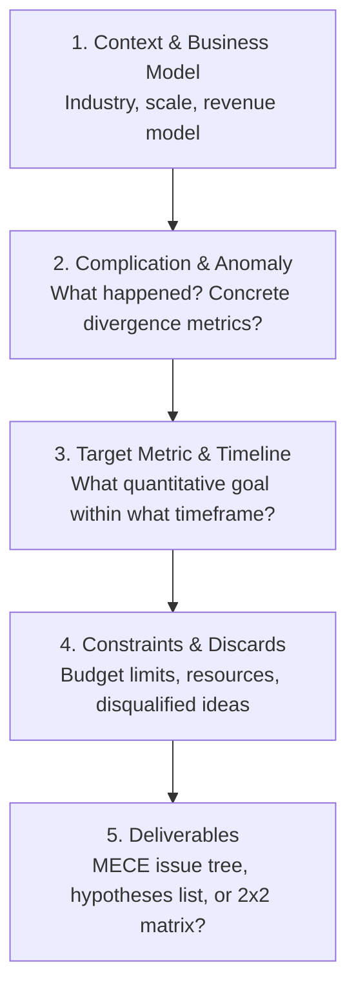

# Management Consultant Prompting Guide: Formulating High-Precision Prompts for AI Advisors

[English](discovery_question_framework.md) | [繁體中文](../zh/discovery_question_framework.md)

> A famous adage across premier management consulting firms (MBB / IBM) states: **"Garbage in, garbage out."**

If you simply ask: *"Our company's revenue is declining, what should we do?"*  
Even an AI loaded with enterprise-grade consulting frameworks can only output textbook generalities (e.g., acquire new customers, increase basket size, enhance marketing campaigns).

To unlock the analytical power of structured consulting methodologies, you must **"speak to the consultant in the language of consultants."**

---

## 1. The 5 Core Building Blocks of Consultant-Grade Prompting (C-C-T-C-D Framework)

To prevent vague outputs, ensure every prompt encapsulates the following five dimensions:



1. **Context & Business Model**:
   * Who are you, and what value do you deliver to whom? (B2B vs. B2C? Direct sales, subscription, or platform commission?)
   * Market position and current scale (Annual recurring revenue? Industry incumbent vs. challenger?)
2. **Complication & Anomaly**:
   * What unexpected variance occurred? (**Include quantitative metrics**, e.g., *"Customer acquisition cost (CAC) surged 40% last quarter"* rather than *"Marketing performance has degraded lately"*).
3. **Target Metric & Timeline**:
   * Set measurable thresholds, e.g., *"Reduce 90-day churn from 8% to 4% over the next 6 months"* instead of *"Improve customer retention"*.
4. **Constraints & Discards**:
   * What boundaries exist? (Budget capped under $100k, zero headcount addition, regulatory compliance, etc.).
   * **What initiatives have already been attempted or explicitly disqualified?** (This prevents the AI from regurgitating solutions your team already explored).
5. **Expected Deliverables**:
   * Specify the desired artifact: a MECE issue tree, a prioritized hypothesis list, an Effort vs. Impact matrix, or a C-suite executive briefing outline.

---

## 2. Vague Prompts vs. Consultant-Grade Prompts Comparison

| Business Scenario | ❌ Vague Prompt (Yields Generic Platitudes) | ✅ Consultant-Grade Prompt (Triggers Deep Analytical Reasoning) |
| :--- | :--- | :--- |
| **Profit Margin Compression** | "Our e-commerce margin has been shrinking recently. Are there good improvement strategies?" | "We are a B2C apparel e-commerce firm with $5M annual revenue (AOV ~$40). Over the past two quarters, **our Gross Margin held steady at 55%, but Net Margin plummeted from 18% to 6%**. Preliminary diagnosis indicates Meta ad CAC rose 60%, and 90-day repeat purchase rate declined 25%.<br><br>**Goal**: Reclaim Net Margin above 12% across the next 2 quarters with flat marketing spend.<br>**Deliverable**: Break down our profitability using a DuPont framework and a MECE issue tree, highlighting the top 3 high-priority kill hypotheses to validate first." |
| **Market Expansion** | "We want to expand our product into the Japanese market. What is the best way?" | "We are a Taiwan-based enterprise HR SaaS provider ($1M ARR, 92% net revenue retention) evaluating market entry into Japan by 2027.<br><br>**Constraints**: Initial overseas budget is capped at $300k with zero local on-the-ground sales headcount.<br>**Deliverable**: From Porter's Five Forces and Go-to-Market (GTM) strategy perspectives, design an evaluation matrix (Direct vs. Distributor vs. Joint Venture) and identify the top 5 critical due diligence questions we must answer before committing." |
| **AI / Tech Modernization** | "We are a logistics company looking to adopt AI. How should we plan this?" | "We operate a regional cold-chain 3PL logistics fleet of 120 trucks. Key pain points are high delivery delay rates (8%) due to manual dispatching, and high support labor costs for parcel tracking inquiries.<br><br>**Goal**: Prioritize GenAI and predictive analytics implementations over the next 18 months.<br>**Deliverable**: Using an IBM Enterprise Design Thinking and ROI/Effort matrix, generate a 30-60-90 day digital transformation blueprint, identifying potential organizational resistance and operational risks." |

---

## 3. Ready-to-Use Universal Prompt Template

Copy and tailor this template with your project parameters before engaging an AI strategic advisor:

```text
[Role Definition]
Activate the management-consultant module and adopt the mindset of an MBB / Big 4 Engagement Manager.

[Context & Business Model]
- Industry & Market: [e.g., High-Net-Worth Wealth Management / B2B Industrial Manufacturing]
- Business Model & Scale: [e.g., $10M ARR, high contract value, custom project delivery]
- Core Competitive Moat: [e.g., Proprietary patents, but sales cycles exceed 9 months]

[Complication & Observed Metric]
- Observed Anomaly & Data: [e.g., 65% drop-off in sales funnel between quotation and contract signing]
- Disqualified / Already Attempted Solutions: [e.g., Discounting did not lift conversion; price war is off the table]

[Target & Constraints]
- Primary Target: [e.g., Lift deal closing conversion from 35% to 50% within 6 months]
- Boundaries: [e.g., Zero sales headcount expansion; maintain 40%+ gross margin]

[Desired Deliverables]
1. Do not rush to provide recommendations yet; first deconstruct root causes using a MECE Issue Tree.
2. Outline 3 critical, high-impact hypotheses that must be empirically validated first.
3. Conclude by asking me 3 probing clarification questions that would best narrow your analytical scope.
```

---

## 💡 Executive Tip: The "Reverse Inquiry" Technique

When top-tier consultants start an engagement, **they never offer instant answers; they ask incisive diagnostic questions**.

If your project scope feels broad, append this instruction to the end of your prompt:

> **"Before formulating recommendations, adopt a senior strategy partner perspective and ask me the 3 to 5 most incisive, probing questions that you need answered to uncover the true underlying root cause."**

This instruction immediately shifts the AI into active diagnostic elicitation mode, exposing strategic blind spots and elevating an everyday Q&A into high-value executive counsel.
