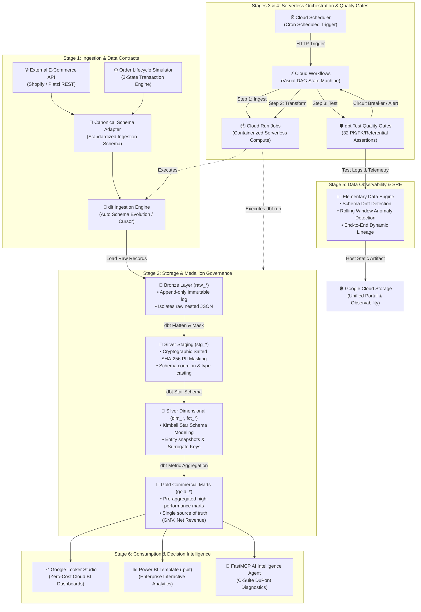

# DataOps System Architecture & Engineering Playbook

[English](pipeline_architecture.md) | [繁體中文](../zh/pipeline_architecture.md)

> **Document Scope**: This document serves as the unified engineering standard for data teams (Data Engineers, Analytics Engineers, Platform Architects). Rooted in DataOps principles, it establishes an enterprise-grade lakehouse designed for **extensibility, high maintainability, zero-idle cost (FinOps), and rigorous data quality gates**.

---

## 🏛️ End-to-End System Architecture

---

## 🔍 Stage-by-Stage Architecture Deep-Dive

### Stage 1: Ingestion & Data Contracts
* **Decoupled Architecture**: Upstream data sources (Platzi API / Shopify) interact exclusively through a Canonical Schema Adapter. Upstream payload modifications never pollute downstream warehouse tables.
* **Auto-Schema Evolution**: Powered by the Python `dlt` engine, nested JSON payloads are automatically inferred, type-cast, and partitioned with stateful watermark checkpoints.
* **Resilience Pattern**: Exponential backoff retries with circuit breaker thresholds for external REST API throttling.

---

### Stage 2: Medallion Architecture & PII Governance
* **Bronze (Raw)**: Append-only immutable landing zone. Preserves untouched raw payloads for audit trail and zero-downtime replayability.
* **Silver (Clean & Conformed)**:
  - **Security & Compliance**: Personally Identifiable Information (PII) like customer names and emails are cryptographically salted and hashed using `SHA-256`, achieving GDPR / CCPA privacy-by-design.
  - **Kimball Dimensional Modeling**: Normalized into fact tables (`fct_orders`, `fct_order_items`) and conform dimension tables (`dim_customers`, `dim_products`).
* **Gold (Marts)**: Pre-aggregated business reporting tables (`gold_daily_sales_kpi`, `gold_customer_ltv`, `gold_product_performance`) optimized for sub-second BI query latency.

---

### Stages 3 & 4: Serverless Orchestration & Quality Gates
* **Serverless Cost Efficiency**: Fully orchestrated via **Google Cloud Scheduler + Cloud Workflows + Cloud Run Jobs**.
  - Replaces heavy, 24/7 VMs (such as self-hosted Airflow or Composer).
  - Idle compute cost is strictly **$0.00**.
* **Automated Circuit Breaker**: If data assertions fail in `dbt test` (e.g., negative prices, unmapped foreign keys, null primary keys), `Cloud Workflows` halts pipeline execution and triggers instant alerts before dirty data reaches Gold marts.

---

### Stage 5: Data Observability & Anomaly Detection
* **In-Warehouse Monitoring**: Elementary Data runs directly within Google BigQuery without separate dedicated daemon nodes.
* **Multi-Dimensional Observability**:
  - Tracks rolling volume distributions, null percentage drift, and schema changes.
  - Automatically compiles standalone interactive reports (`elementary_report.html`) and uploads them to Google Cloud Storage with cache-busting headers.

---

### Stage 6: Consumption & Decision Intelligence
* **Multi-Channel Delivery**:
  - **Executive Dashboards**: Looker Studio for executive summaries; Power BI (`.pbit`) for deep-dive exploratory analytics.
  - **AI Copilot (FastMCP)**: A lightweight Model Context Protocol server exposing verified BigQuery schema contexts to Claude, ChatGPT, or Antigravity for automated DuPont financial diagnostics.

---

## 📋 Peer Review & Production Readiness Checklist

| Category | Verification Item | Standard | Status |
| :--- | :--- | :--- | :---: |
| **Data Quality** | Primary Key Uniqueness & Non-null | Enforced on all models | ✅ Pass |
| **Referential Integrity** | Foreign Key Relationships (`fct_orders` ➔ `dim_customers`) | Tested on every build | ✅ Pass |
| **Security** | Salted SHA-256 PII Masking | Enforced in Silver layer | ✅ Pass |
| **FinOps** | Zero Idle Server Infrastructure | 100% Serverless on GCP | ✅ Pass |
| **Observability** | Automated GCS Report Upload & Lineage | Continuous synchronization | ✅ Pass |
