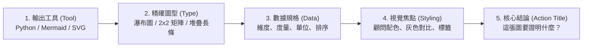

# 精準圖表生成指南：如何向 AI 下 Prompt 繪製頂級顧問級圖表 (Data Visualization Prompting Guide)

[English](CHART_PROMPT_GUIDE.md) | [繁體中文](圖表生成指南.md)

在商業分析與管理顧問（MBB / IBM）的標準中：**「一張優秀的圖表不是為了展示數據，而是為了傳遞結論（Action Title）。」**

如果你只對 AI 說：「*幫我畫一張過去一年的營收圖*」  
AI 通常會給你一張配色雜亂、圖表類型平庸（例如隨便選個折線圖或擁擠的圓餅圖）、且缺乏商業洞察的「半成品」。

要讓 AI **100% 精準**繪製出可直接放進 C-Level 匯報的圖表，你必須提供完整的**「圖表規格清單（C-T-D-S-A 框架）」**。

---

## 一、 精準圖表 Prompt 的 5 大核心要素（C-T-D-S-A 框架）



1. **圖表引擎與格式（Tool & Engine）**：
   * **Streamlit 互動儀表板（本專案 Tab 4 預設）**：指定 **`Python (Plotly)`**（系統可直接動態編譯執行並渲染出具備懸停 Tooltip 的互動元件）。
   * **純 Markdown 文本報告 / 流程架構**：指定 `Mermaid.js`、`SVG` 或 `PlantUML`。
   * **統計報告與離線出版**：指定 `Python (Matplotlib / Seaborn)`。
2. **精確圖表類型（Chart Type）**：
   * 不要讓 AI 猜！根據分析目的直接指定：
     * **原因拆解 / 利潤歸因** ➔ 瀑布圖（Waterfall Chart）
     * **優先級 / 策略定位** ➔ 2x2 矩陣（Matrix Quadrant）
     * **結構比例與演變** ➔ 100% 堆疊長條圖（Stacked Bar）
     * **漏斗轉化與流失** ➔ 轉化漏斗圖（Funnel Chart）
3. **數據來源與結構（Data & Axis Mapping）**：
   * 明確告知 X 軸、Y 軸、分組（Hue/Series）、數值單位（千元/百分比/百萬）。
   * 指名**排序邏輯**（例如：「由大到小遞減排序，其他（Others）放最後」）。
4. **顧問級視覺規範（Visual Hierarchy & Styling）**：
   * **重點凸顯法則**：不要五顏六色。指定「常態項目統一使用淺灰（#E5E7EB），異常/需聚焦的核心項目使用高對比警示色（如深藍 #1E3A8A 或暗紅 #DC2626）」。
   * **數據標籤**：指定「直接標註數值於頂端，隱藏雜亂的背景網格線（Gridlines）」。
5. **結論型標題（Action Title & 'So What?'）**：
   * 顧問級圖表上方必須是一句**「結論」**，而非單純的描述性標題（如：寫「Q3 亞太區物流成本暴增 34%，侵蝕整體營業利潤」，而不是「Q3 各區成本統計圖」）。

---

## 二、 負向約束清單（Negative Constraints）

在 Prompt 加上這段「防呆禁令」，能瞬間過濾掉 90% 的低質感 AI 圖表：

```text
【繪圖負向約束】
- 嚴禁使用 3D 效果與立體陰影。
- 嚴禁使用彩虹配色（Rainbow colormaps）。
- 嚴禁圖例蓋到任何數據本體或折線。
- 若為圓餅圖，切片不得超過 5 塊；若分類過多，請自動切換為水平長條圖。
- 數值標籤請加上千分位逗號（,）與單位符號（% 或 $），避免長串浮點數。
```

---

## 三、 實戰示範：3 大高頻商業圖表 Prompt 模板

### 1. 策略優先級矩陣（2x2 Strategy Matrix / Python Plotly）
> **適用情境**：在 Streamlit 儀表板中評估多項業務提案或功能開發的優先順序（影響力 vs. 執行難度）。

```text
請撰寫一段獨立可運行的 Python (使用 Plotly) 程式碼，繪製一張「策略優先級 2x2 矩陣（Impact vs. Effort Matrix）」：
1. 座標定義：
   - X 軸：實施難度與成本 Effort（範圍 0 到 10，中線基準設在 5）
   - Y 軸：商業影響力與回報 Impact（範圍 0 到 10，中線基準設在 5）
2. 四大象限標籤與背景區塊（使用 add_shape 繪製柔和色塊）：
   - 左上（高 Impact / 低 Effort）：淺綠色區塊 (#E8F5E9)「第一優先 Quick Wins」
   - 右上（高 Impact / 高 Effort）：淺藍色區塊 (#E3F2FD)「策略性長線投資 Strategic Bets」
   - 左下（低 Impact / 低 Effort）：淺灰色區塊 (#F5F5F5)「順手填充項目 Fill-ins」
   - 右下（低 Impact / 高 Effort）：淺紅色區塊 (#FFEBEE)「無效益陷阱 Thankless Tasks」
3. 填入數據散佈點（Scatter Points + 文字標籤）：
   - 自動化報價系統: Effort=2.5, Impact=8.5 (Quick Win, 高亮深綠色標記 #2E7D32)
   - 核心 ERP 系統更換: Effort=8.0, Impact=8.0 (Strategic Bet, 藍色 #1565C0)
   - 內部週報模板更新: Effort=2.0, Impact=2.5 (Fill-in, 灰色 #757575)
   - 客製化特定單一客戶報表: Effort=7.5, Impact=3.0 (Thankless Task, 灰色 #757575)
4. 視覺焦點：請將「自動化報價系統」以較大尺寸的深綠色圓點醒目標示。
5. 結論型標題（Action Title）：
   - 主標題：「資源應高度聚焦於『自動化報價系統』以在 30 天內快速釋放業務產能」
   - 副標題：「2026 Q3 商業提案與數位轉型優先級評估（Impact vs. Effort 2x2 矩陣）」
```

---

### 2. 財務與利潤歸因瀑布圖（Profit Waterfall Chart / Python Plotly）
> **適用情境**：向 C-Level 匯報毛利、成本、費用如何逐層推演至最終淨利。

```text
請撰寫一段獨立可運行的 Python (使用 Plotly) 程式碼，繪製一張「利潤變動瀑布圖（Waterfall Chart）」：
1. 數據序列（以百萬台幣為單位）：
   - 基準營收：+120
   - 原料採購成本：-45
   - 運費與供應鏈附加費：-18
   - 研發與人事費用：-25
   - 行銷推廣支出：-12
   - 業外收益：+5
   - 最終營業淨利：合計（Total）
2. 視覺顏色規範：
   - 正向增加：深綠色 (#2E7D32)
   - 負向扣減：暗紅色 (#C62828)
   - 最終統計總額：企業深藍色 (#1565C0)
3. 標籤與格式：
   - 每個長條上方需自動標註 "+數值" 或 "-數值"，字體需加粗。
   - 隱藏縱向網格線，背景保持乾淨純白。
4. 標題與副標：
   - 主標題（Action Title）：「供應鏈附加費與原料成本擴大，導致本季淨利降至 2,500 萬」
   - 副標題：「2026 Q3 營業利益驅動因素拆解（單位：百萬 NTD）」
```

---

### 3. 多維度對比長條圖（Benchmark & Focus Bar Chart / Python Seaborn）
> **適用情境**：在眾多競爭對手或產品線中，單獨高亮自家產品或特定異常項。

```text
請使用 Python (Matplotlib/Seaborn) 繪製一張乾淨的「水平長條圖（Horizontal Bar Chart）」，規範如下：
1. 數據集（2026 各產品線淨利潤率 %）：
   - 產品 A: 28%
   - 產品 B (核心自研): 24%  <-- 需高亮
   - 產品 C: 19%
   - 產品 D: 15%
   - 產品 E: 11%
   - 產品 F: 6%
2. 排序方式：由上至下依淨利潤率由高到低排列。
3. 顧問級配色原則：
   - 除了「產品 B」使用深藍色 (#1E40AF) 以外，其餘所有長條統一使用無干擾的淺灰色 (#CBD5E1)。
4. 刻度與標籤：
   - 移除上方、右方與左方的坐標軸線（despine）。
   - 在每個長條右側直接印出具體百分比文字（如 "24%"），不必讓讀者肉眼對齊 X 軸。
5. 結論標題：
   - 「產品 B 利潤率（24%）高於同品類均值，具備擴大投放獲取市佔之潛力」
```

---

## 四、 可以直接套用的「圖表生成萬用 Prompt 模板」

複製以下模板，將括號 `[ ]` 內的內容替換為你的具體資料：

```text
【圖表角色與工具要求】
請扮演頂級管理顧問公司（MBB）的資訊圖表專家（Information Designer）。
請使用 [指定工具：Python Matplotlib / Python Plotly / Mermaid.js / SVG] 繪製一張專業商務圖表。

【圖表類型與主題】
- 圖表類型：[例：水平對比長條圖 / 2x2 優先級矩陣 / 趨勢折線圖 / 瀑布圖]
- 核心受眾：[例：董事會 / 部門主管 / 投資人]
- 圖表核心結論（Action Title）：[例：行銷管道 C 的 ROI 高達 4.2x，應加碼預算]

【輸入數據結構】
- X 軸 / 類別：[提供類別清單，例如：產品線 A, B, C, D]
- Y 軸 / 數值與單位：[提供具體數字與單位，例如：營收 (百萬元) 或 轉化率 (%)]
- 排序需求：[例：由大到小排序 / 依時間順序]

【視覺與排版規範】
1. 配色策略：採用顧問級灰階 + 主題高亮色。將 [需突出的項目名稱] 使用 [指定高亮色如深藍/紅]，其餘項目統一使用淺灰 (#D1D5DB)。
2. 標籤要求：直接在圖表元素上方/側邊標註數據數值，字體加粗，格式帶千分位與單位。
3. 簡約設計：移除冗餘的背景格線與外框線，確保圖面整潔、閱讀零阻力。

【交付要求】
請直接提供 [可獨立執行的完整代碼 / 純文字 Mermaid 語法塊]，並附上 2~3 句圖表商業洞察解讀。
```

> 💡 **本專案實戰提醒**：若您是在本專案的 **Streamlit 儀表板（Tab 4 AI 自然語言圖表生成器）** 輸入提問，請務必將指定工具填為 **`Python Plotly`**，系統才能在瀏覽器中直接將程式碼動態渲染為可互動的專業圖表！

