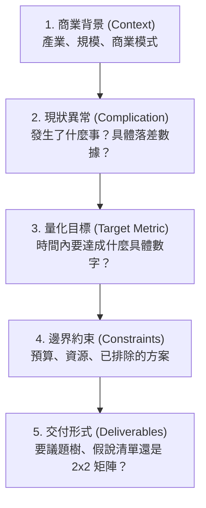

# 商業顧問提問指南：如何向 AI 顧問精準提問 (Management Consultant Prompting Guide)

[English](PROMPT_GUIDE.md) | [繁體中文](提問框架.md)

> 在頂級管理顧問（MBB / IBM）的文化中有一句名言：**「垃圾進，垃圾出（Garbage in, garbage out）」**。

如果你問：「*我們公司營收下滑，該怎麼辦？*」  
即使 AI 裝了最頂級的顧問技能（例如 `claude-skill-management-consultant-B1`），它也只能回你幾條教科書等級的空泛建議（如：開拓新客、提高客單價、加強行銷）。

要讓顧問 Skill 真正發揮 129 個專業模組的威力，你需要**「用顧問的語言向顧問提問」**。

---

## 一、 頂級顧問提問的「5 大核心拼圖」（C-C-T-C-D 框架）

避免問題空泛的最佳方式，就是在提問時包含以下 5 個要素：



1. **商業背景（Context & Business Model）**：
   * 你是誰？賣什麼給誰？（B2B 還是 B2C？直銷、訂閱制、還是平台抽成？）
   * 市場定位與目前規模（年營收約多少？在產業是領先者還是挑戰者？）
2. **現狀衝突與觸發事件（Complication）**：
   * 發生了什麼異常？（**要有具體數值**，例如：「上一季獲客成本 CAC 暴增 40%」而不是「最近行銷效果不好」）。
3. **量化目標與時間跨度（Target & Timeline）**：
   * 具體目標不是「改善狀況」，而是「在 6 個月內將流失率（Churn Rate）從 8% 降至 4%」。
4. **邊界與約束條件（Constraints & Discards）**：
   * 有什麼限制？（預算不超過 200 萬、不能裁員、法規限制等）。
   * **有哪些方法你們已經試過或明確不可行？**（這能防止 AI 給出你們早就知道的廢話）。
5. **指定顧問輸出產物（Deliverables）**：
   * 你希望它給出「MECE 議題樹」、「可測試的假說清單」、「決策矩陣」還是「C-Level 總裁簡報大綱」？

---

## 二、 空泛提問 vs. 顧問級提問 對照表

| 案例場景 | ❌ 空泛提問（得到教科書廢話） | ✅ 顧問級高階提問（觸加 Skill 深度模組） |
| :--- | :--- | :--- |
| **利潤衰退** | 「我們公司的電商利潤最近變薄了，有沒有好的改善策略？」 | 「我們是一家年營收 1.5 億台幣的 B2C 服飾電商（客單價約 1,200 元）。過去兩季 **毛利率維持 55%，但淨利率從 18% 崩跌至 6%**。初判是 Meta 廣告投放 CAC 上升 60%，且舊客 90 天回購率下滑 25%。<br><br>**目標**：在行銷預算不增加的前提下，預計用 2 季將淨利率拉回 12% 以上。<br>**需求**：請用杜邦分析與 MECE 邏輯幫我拆解利潤議題樹，並標出最優先驗證的 3 個關鍵假說（Kill Hypotheses）。」 |
| **新市場拓展** | 「我們想把產品賣到日本市場，該怎麼做比較好？」 | 「我們是台灣企業級 HR SaaS 軟體（ARR 約 3,000 萬台幣，客戶留存率 92%），現正評估 2027 年進入日本市場。<br><br>**限制**：初期海外預算僅 1,000 萬台幣，且當地無在地實體團隊。<br>**需求**：請從波特五力與進入策略（Go-to-Market）視角，幫我設計一套評估矩陣（直營 vs. 代理經銷 vs. 跨國合資），並列出盡職調查（Due Diligence）必須優先回答的 5 個核心商業問題。」 |
| **新技術 / AI 導入** | 「我們是一家物流公司，想導入 AI，可以怎麼規劃？」 | 「我們是區域型冷鏈第三方物流（3PL），車隊規模約 120 輛，目前主要痛點是路線調度人工作業導致延誤率高（8%），且客服查詢包裹耗費大量人力。<br><br>**目標**：評估 GenAI 與預測算法在未來 18 個月的導入優先級。<br>**需求**：請以 IBM Enterprise Design Thinking 與價值實現（ROI/Effort 矩陣）架構，幫我產出 30/60/90 天的數位轉型落地藍圖，並指出潛在的組織抗性與風險。」 |

---

## 三、 可以直接複製的「提問萬用模板」

你可以將以下模板複製並填入你的具體情境後發送給 AI：

```text
【專案角色設定】
請啟動 management-consultant 模組，以 MBB / IBM 專案經理（Engagement Manager）的角色進行思考。

【商業背景 Context】
- 產業與市場：[例：台灣高資產客群財富管理 / B2B 電子零組件製造]
- 商業模式與規模：[例：年營收約 2 億、高客單價、以專案客製為主]
- 核心競爭優勢：[例：產品研發能力強，但業務銷售週期長]

【痛點與現狀 Complication】
- 具體現象與數據：[例：銷售漏斗在「報價至簽約」階段流失了 65% 的潛在客戶]
- 我們已嘗試或排除的方案：[例：已降價促銷但效果有限，不想再打價格戰]

【專案目標 Target & Constraints】
- 核心目標：[例：在 6 個月內將簽約轉換率從 35% 提升至 50%]
- 約束限制：[例：不增加業務人力、維持現有產品毛利 40% 以上]

【期望交付 Output】
1. 請先不要急著給最終建議，請先用 MECE 議題樹（Issue Tree）拆解造成此問題的潛在根因。
2. 列出 3 個「最關鍵、最先需要用數據驗證的假說（Hypotheses）」。
3. 在回答最後，對我提出 3 個你認為最關鍵、有助於收斂分析範圍的「反問（Clarification Questions）」。
```

---

## 💡 秘訣：讓分析品質翻倍的「反客為主」技巧

頂級顧問在剛接案時，**絕不會直接丟解決方案，而是會先反問客戶很多尖銳的問題**。

當你的問題可能還不夠聚焦時，建議在提問最後加上這句話：

> **「在為我產出最終策略前，請以資深顧問的角度，反問我 3~5 個你認為最關鍵、最能切中核心但目前我尚未提及的商業/數據問題。」**

這會立即觸發 AI 進入「需求訪談（Elicitation）與痛點深掘」模式，逼出更多盲點，瞬間把一次普通的問答提升為百萬級的策略諮詢！
